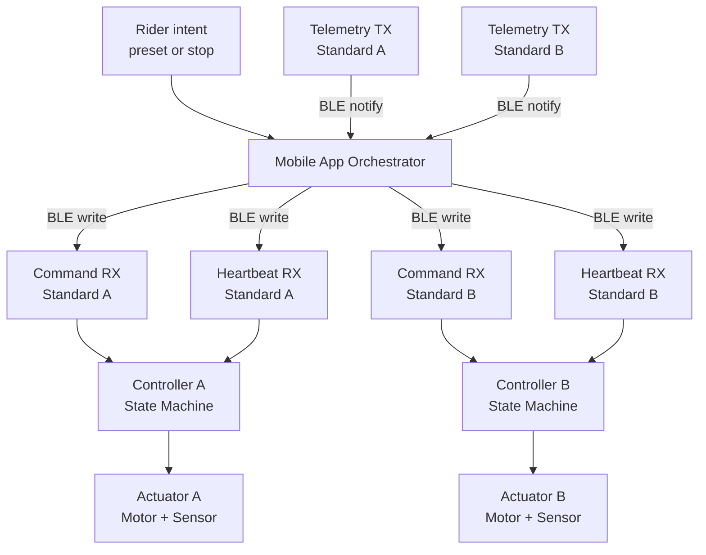

# Smart Jump Prototype

Mounted Bluetooth Control System for Automated Jump Standards

A safety-first, synchronization-aware prototype modeling an automated jump system that allows riders to adjust jump height without dismounting.

---

## The Problem

In show jumping and training environments, riders frequently adjust jump height between warmup sets and working sets.

Typical workflow today:

- Warm up at 2'0"
- Dismount
- Manually lift heavy poles
- Reposition cups
- Remount
- Continue training

This creates several real-world inefficiencies:

- Time loss between sets
- Physical strain from repeatedly lifting poles
- Safety risk when adjusting alone
- Training interruption and loss of rhythm
- Reduced productivity during limited arena time

Common scenarios:

- Riders training alone
- Junior riders without ground assistance
- Trainers managing multiple students
- Trainers recovering from injury
- High-volume training barns where time efficiency matters

Height adjustment is manual, heavy, repetitive, and operationally inefficient.

---

## Proposed Solution

Smart Jump enables mounted height adjustment via Bluetooth control.

The rider selects a preset height from a mobile interface while mounted. Both jump standards move in synchronized fashion to the new height under strict safety constraints.

The system enforces:

- Coordinated motion
- Desynchronization detection
- Heartbeat supervision
- Coordinated stop on anomaly
- Fault latching until explicit reset

This transforms jump adjustment from a manual labor task into a controlled system operation.

---

## Business Value

### 1. Time Efficiency

Reducing repeated dismount and adjustment cycles increases productive training time.

In high-volume barns, this compounds across:

- Multiple riders
- Multiple lessons
- Daily repetition

### 2. Reduced Physical Strain

Manual pole adjustment is repetitive and physically demanding. Automation reduces strain and injury risk.

### 3. Solo Training Enablement

Riders training alone can safely adjust height without assistance.

### 4. Operational Differentiation

Training facilities offering automated jump infrastructure differentiate themselves through:

- Efficiency
- Modernization
- Safety-conscious design

### 5. Accessibility for Injured Trainers

Instructors recovering from injuries can continue coaching without lifting poles.

---

## System Overview

The system models two independent jump standards, each running a local safety controller.

A mounted mobile application orchestrates both standards and enforces synchronization and fault management.

Each standard enforces:

- Motion state machine
- Height tracking
- Heartbeat timeout enforcement
- Fault latching
- Stop gating

The app enforces:

- Synchronized preset commands
- Continuous heartbeat transmission
- Telemetry monitoring
- Desynchronization detection
- Coordinated stop behavior

The firmware layer is currently implemented as a deterministic emulator to validate safety logic prior to hardware integration.

---

## System Architecture

### End-to-End Data Flow

---

## Safety Architecture

Safety is enforced at two independent layers.

### Controller-Level Safety

- Motion allowed only in idle_ready
- Heartbeat timeout triggers fault state
- Faults are latched until explicit reset
- Stop accepted at any time
- Limit or overload triggers immediate fault

### App-Level Safety

- Continuous telemetry monitoring
- Configurable desynchronization tolerance
- Coordinated stop on anomaly
- Device fault propagation
- Explicit reset required after fault

All safety behavior is validated via deterministic simulation tests.

---

## Repository Structure

app/  
Application orchestrator and synchronization logic  

ble/  
GATT emulator modeling firmware BLE contract  

tests/  
Deterministic unit tests validating safety behavior  

docs/  
Architecture and state diagrams  

firmware/  
Planned embedded implementation layer  

hardware/  
Mechanical and electrical planning documentation  

mobile_app/  
Future mounted UI layer  

test_artifacts/  
Reserved for validation traces  

---

## Running the Prototype

Run tests:

python3 -m pytest -q

Run demonstration scenario:

python3 demo_run.py

The demo simulates:

- Normal synchronized motion
- Desync fault during active movement
- Coordinated stop enforcement

---

## Development Workflow

This repository follows structured engineering discipline:

Issue → Feature Branch → Merge Request → CI → Merge → Issue Close

Enforced by:

- Structured issue templates
- Structured merge request template
- No direct commits to main
- CI validation before merge

---

## Current Status

Prototype complete for:

- BLE contract modeling
- Dual-controller synchronization logic
- Heartbeat enforcement
- Desync detection with configurable tolerance
- Deterministic state machine design
- CI integration
- Structured workflow enforcement

Next milestone:

- Replace emulator with ESP32 firmware
- Integrate encoder + actuator hardware
- Validate mechanical backlash tolerance
- Field-test mounted control flow
- Conduct cost analysis for $2000–$4000 hardware build target

