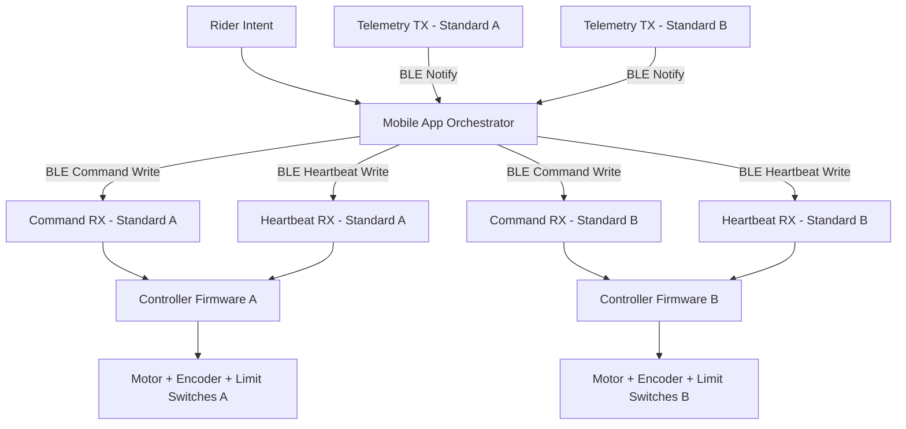

# Smart Jump Prototype

<p align="center">


</p>

<p align="center">
<a href="https://smart-jump-prototype.onrender.com">

</a>
</p>

<p align="center">

</p>

---

# Intelligent Jump Infrastructure for Mounted Training

Smart Jump transforms **manual jump adjustment** into **synchronized, safety supervised motion**.

The system models a Bluetooth controlled jump standard pair that can raise or lower cups while the rider remains mounted.

Instead of interrupting training to move poles manually, a rider selects a preset and the system performs a coordinated, monitored adjustment.

The prototype focuses on:

• synchronization guarantees  
• deterministic state machines  
• layered safety enforcement  
• realistic hardware architecture  

before any physical hardware deployment.

---

# Live Interactive Demo

Open the hosted demo:

https://smart-jump-prototype.onrender.com

The live interface allows you to:

• set jump height presets  
• trigger synchronized movement  
• simulate desynchronization faults  
• stop motion immediately  
• reset the system after a fault  

Note: the free hosting instance may take ~20 seconds to wake up.

---

# System Overview

<p align="center"><b>Smart Jump Control Architecture</b></p>



Architecture documentation:

• docs/09_state_diagrams.md  
• docs/11_system_architecture.md  

---

# The Problem

In show jumping training, height adjustments happen constantly.

Warmups  
Progressive training sets  
Competition height preparation  
Technical combinations

Today, adjusting jumps requires:

• dismounting  
• lifting heavy poles  
• moving cups manually  
• remounting  
• resuming training  

That cycle repeats dozens of times in a session.

The consequences:

• lost training rhythm  
• unnecessary physical strain  
• slower session pacing  
• difficulty training alone  

Professional riders, trainers, and barns spend time adjusting equipment instead of improving performance.

---

# The Shift

Smart Jump reframes height adjustment as **infrastructure instead of labor**.

Mounted preset selection  
→ coordinated motion  
→ supervised stop  
→ stable safe state

Training should be limited by **skill**, not by **logistics**.

---

# System Concept

The architecture models a complete mounted jump adjustment system.

Core components:

• two independent jump standards  
• a supervisory mobile orchestrator  
• Bluetooth Low Energy communication  
• dual-layer safety enforcement  

Each jump standard acts as a **self-contained safety controller**.

The mobile application supervises synchronization and fault conditions.

---

# Safety Model

Safety is enforced at two independent layers.

## Controller Layer Guarantees

Each jump standard enforces:

• motion only when in idle_ready state  
• stop accepted in all states  
• heartbeat timeout triggers fault  
• faults latch until reset  
• mechanical limits stop motion immediately  

## Orchestrator Layer Guarantees

The mobile application supervises:

• continuous telemetry monitoring  
• configurable desynchronization tolerance  
• coordinated stop across both standards  
• fault propagation from either device  
• manual reset before reactivation  

If synchronization diverges beyond tolerance, both standards halt.

All invariants are validated through deterministic simulation tests.

---

# Business Impact

## Operational Efficiency

• eliminates repeated mount/dismount cycles  
• preserves training rhythm  
• increases productive arena time  

## Physical Strain Reduction

• removes repetitive lifting  
• reduces instructor fatigue  
• supports injured trainers  

## Facility Differentiation

• technology-forward training infrastructure  
• modernized arena equipment  
• premium branding signal for competitive barns  

---

# Financial Feasibility

Target build range:

$2000 – $4000

Key design tradeoffs:

| Category | Design Focus |
|--------|--------|
| Actuators | load capacity vs speed |
| Encoders | precision vs cost |
| MCU | ESP32 class controller |
| Power | battery vs fixed supply |
| Mechanical | backlash tolerance |
| Safety | limit switches + hard stops |

Designed for **serious private barns and professional facilities**.

---

# Technical Capabilities

Current prototype implements:

• BLE contract modeling  
• dual-controller synchronization logic  
• heartbeat supervision  
• configurable desync tolerance  
• coordinated stop behavior  
• deterministic state machine validation  
• CI-integrated safety testing  
• installable CLI entry point  

---

# Running the Prototype

Install in editable mode:

```bash
python3 -m pip install -e ".[dev]"
```

Run automated tests:

```bash
smartjump test
```

Run the simulation:

```bash
smartjump demo
```

Run the web interface locally:

```bash
python3 -m smartjump.ui
```

Then open:

http://127.0.0.1:8000

---

# Live API Demo

Check system state:

```bash
curl -s https://smart-jump-prototype.onrender.com/api/state | python3 -m json.tool
```

Send preset height:

```bash
curl -X POST https://smart-jump-prototype.onrender.com/api/preset \
-H "Content-Type: application/json" \
-d '{"height_in":60}'
```

Force desynchronization:

```bash
curl -X POST https://smart-jump-prototype.onrender.com/api/force_desync
```

Stop motion:

```bash
curl -X POST https://smart-jump-prototype.onrender.com/api/stop
```

Reset system:

```bash
curl -X POST https://smart-jump-prototype.onrender.com/api/reset
```

---

# Development Discipline

Engineering workflow:

Issue → Branch → Merge Request → CI → Merge → Close

Practices enforced:

• structured issue templates  
• merge request templates  
• no direct commits to main  
• deterministic safety testing  

This mirrors **real-world safety-conscious engineering practice**.

---

# Roadmap

Phase 1 Deterministic Control Modeling ✔  
Phase 2 ESP32 Firmware Integration  
Phase 3 Actuator and Encoder Validation  
Phase 4 Mechanical Load Testing  
Phase 5 Mounted Field Trials  
Phase 6 Cost Optimization and Production Modeling  

---

Smart Jump represents the modernization of equestrian training infrastructure through synchronized, safety controlled automation.