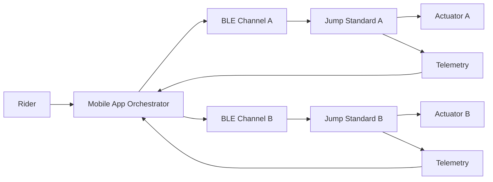

# Smart Jump Prototype


---

<p align="center">
<a href="https://smart-jump-prototype.onrender.com">

</a>
</p>

---

## Intelligent Jump Infrastructure for Mounted Training

Transforming manual jump adjustment into synchronized, safety supervised motion.

Smart Jump is a deterministic control architecture prototype that models Bluetooth operated jump standards for performance riders and professional training environments.

This repository focuses on synchronization guarantees, safety invariants, and layered fault enforcement before any physical hardware deployment.

---

## Live Interactive Demo

Open the live Smart Jump interface:

https://smart-jump-prototype.onrender.com

The hosted demo allows you to:

- set jump height presets  
- trigger synchronized motion  
- simulate desynchronization faults  
- stop motion immediately  
- reset the system  

Note: the free hosting instance may take about 20 seconds to wake up if idle.

---

## Live API Demo

Check system state:

```bash
curl -s https://smart-jump-prototype.onrender.com/api/state | python3 -m json.tool
```

Trigger synchronized motion:

```bash
curl -s -X POST https://smart-jump-prototype.onrender.com/api/preset \
  -H 'Content-Type: application/json' \
  -d '{"height_in":60}'
```

Simulate a desynchronization fault:

```bash
curl -s -X POST https://smart-jump-prototype.onrender.com/api/force_desync
```

---

## System Overview

<p align="center">
<b>Smart Jump Control Architecture</b>
</p>



Detailed design artifacts:

- docs/09_state_diagrams.md  
- docs/11_system_architecture.md  

---

## The Problem

In show jumping training, height changes occur constantly:

- warmup  
- progressive sets  
- competition height  
- technical combinations  

Today this requires:

- dismount  
- lift heavy poles  
- reposition cups  
- remount  
- resume  

That interruption compounds across sessions.

It costs time.  
It breaks rhythm.  
It adds physical strain.  
It limits solo training.

Riders training alone lose valuable momentum.  
Trainers with injuries face unnecessary strain.  
Facilities waste time that could be spent improving performance.

---

## The Shift

Smart Jump reframes height adjustment as infrastructure instead of labor.

Mounted preset selection → coordinated motion → supervised stop → stable safe state.

Training should be limited by skill, not by logistics.

---

## System Concept

The system consists of:

- two independent jump standards  
- one supervisory mobile orchestrator  
- Bluetooth Low Energy communication  
- dual layer safety enforcement  

Each standard is a self contained safety device.

The mobile application acts as synchronization authority and fault supervisor.

---

## Safety Model

Safety enforcement exists at two independent layers.

### Controller Layer Guarantees

- motion only in idle_ready  
- stop accepted in all states  
- heartbeat timeout triggers fault  
- fault latched until reset  
- limit or overload triggers immediate halt  

### Orchestrator Layer Guarantees

- continuous telemetry monitoring  
- configurable desynchronization tolerance  
- coordinated stop across both standards  
- fault propagation from either device  
- explicit reset required before reactivation  

If synchronization diverges beyond tolerance, both standards halt.

All invariants are validated through deterministic simulation tests.

---

## Business Impact

### Operational Efficiency

- eliminates repeated mount and dismount cycles  
- preserves training rhythm  
- increases productive arena time  

### Physical Strain Reduction

- removes repetitive lifting  
- reduces instructor fatigue  
- supports injured trainers  

### Facility Differentiation

- technology forward positioning  
- modernized training infrastructure  
- premium branding signal  

---

## Financial Feasibility

Target build range: $2000 to $4000

| Category | Design Focus |
|----------|--------------|
| Actuators | Load vs response speed |
| Encoders | Precision vs cost |
| MCU | ESP32 class |
| Power | Battery vs fixed supply |
| Mechanical | Backlash tolerance |
| Safety | Hard stops and limit switches |

Designed for serious private barns and professional facilities.

---

## Technical Capabilities

Current prototype includes:

- BLE contract modeling  
- dual controller synchronization logic  
- heartbeat supervision  
- configurable desync tolerance  
- coordinated stop behavior  
- deterministic state machine validation  
- CI integrated safety testing  
- installable CLI entry point  

---

## Running the Prototype

Install in editable mode:

```bash
python3 -m pip install -e ".[dev]"
```

Run automated tests:

```bash
smartjump test
```

Run the local interactive simulation:

```bash
python3 -m smartjump.ui
```

Then open:

http://127.0.0.1:8000

---

## Development Discipline

Structured engineering workflow:

Issue → Branch → Merge Request → CI → Merge → Close

Enforced through:

- structured issue templates  
- structured merge request template  
- no direct commits to main  
- deterministic safety validation  

This mirrors real world safety conscious development practice.

---

## Roadmap

Phase 1 deterministic control modeling complete  
Phase 2 ESP32 firmware integration  
Phase 3 actuator and encoder validation  
Phase 4 mechanical load testing  
Phase 5 mounted field trials  
Phase 6 cost optimization and production modeling  

---

Smart Jump represents the modernization of equestrian training infrastructure through synchronized, safety controlled automation.