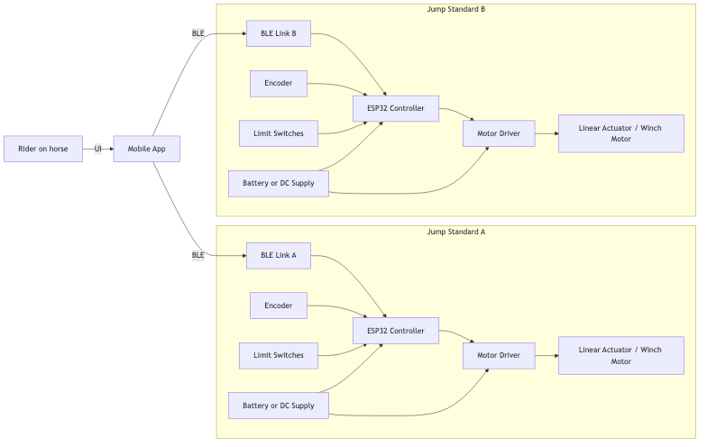
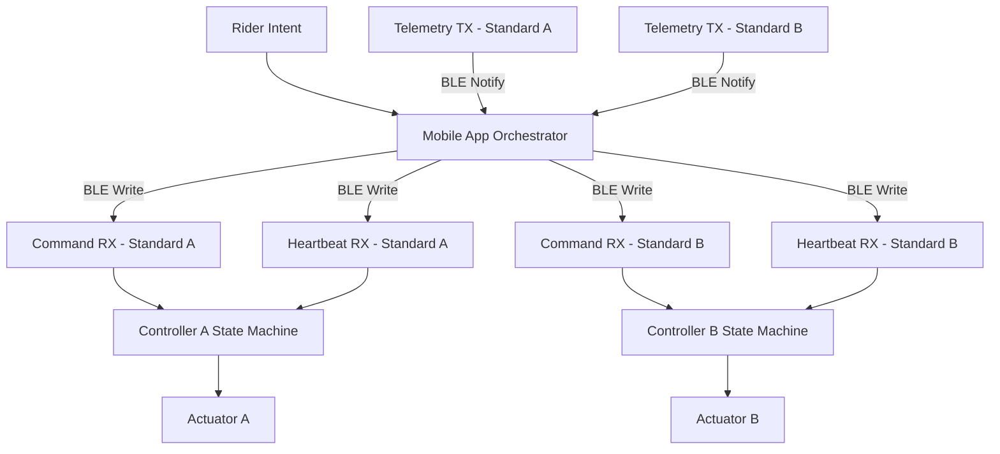
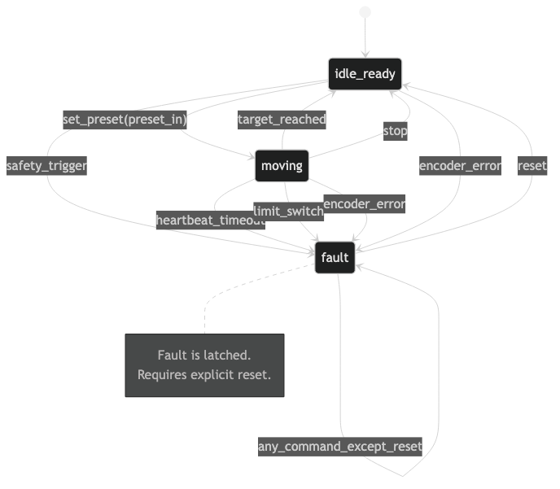

# Smart Jump Prototype


---

<p align="center">

<a href="https://arisharazakhan-cpu.github.io/smart-jump-prototype/">

</a>

</p>

---

## Intelligent Jump Infrastructure for Mounted Training

Transforming manual jump adjustment into synchronized, safety supervised motion.

Smart Jump is a deterministic control architecture prototype that models Bluetooth operated jump standards for performance riders and professional training environments.

This repository focuses on synchronization guarantees, safety invariants, and layered fault enforcement before any physical hardware deployment.

---

## Live Interactive Demo

Open the live Smart Jump interface:

https://arisharazakhan-cpu.github.io/smart-jump-prototype/

<p align="center">
<a href="https://arisharazakhan-cpu.github.io/smart-jump-prototype/">

</a>
</p>

The hosted demo allows you to:
- set jump height presets
- drag to any custom height from 12 to 72 inches
- issue constrained hands-free voice commands
- watch all three rails move through an animated digital twin
- inspect live synchronization and safety-gate status
- trigger synchronized motion
- simulate desynchronization faults
- stop motion immediately
- reset the system

The GitHub Pages demo runs entirely in the browser, so it opens immediately without waiting for a server to wake up.

---

## The Problem

In show jumping training, height changes occur constantly:

- Warmup  
- Progressive sets  
- Competition height  
- Technical combinations  

Today this requires:

- Dismount  
- Lift heavy poles  
- Reposition cups  
- Remount  
- Resume  

That interruption compounds across sessions.

It costs time.  
It breaks rhythm.  
It adds physical strain.  
It limits solo training.

Riders training alone lose valuable momentum.  
Trainers with injuries face unnecessary strain.  
Facilities waste time that could be spent improving performance.

---

## The Shift

Smart Jump reframes height adjustment as infrastructure instead of labor.

Mounted preset selection → Coordinated motion → Supervised stop → Stable safe state.

Training should be limited by skill, not by logistics.

---

## System Concept

The system consists of:

- two independent jump standards  
- one supervisory mobile orchestrator  
- Bluetooth Low Energy communication  
- dual layer safety enforcement  

Each standard is a self contained safety device.

The mobile application acts as synchronization authority and fault supervisor.

---

## System Architecture

<p align="center">

</p>

High level hardware architecture illustrating the supervisory mobile orchestrator and two independent jump standards.

<p align="center"><b>End to End System Data Flow</b></p>



Detailed design artifacts:

- docs/09_state_diagrams.md  
- docs/11_system_architecture.md  

---

## Safety Model

<p align="center">

</p>

Controller state machine enforcing deterministic motion control and fault handling.

Safety enforcement exists at two independent layers.

### Controller Layer Guarantees

- motion only in idle_ready  
- stop accepted in all states  
- heartbeat timeout triggers fault  
- fault latched until reset  
- limit or overload triggers immediate halt  

### Orchestrator Layer Guarantees

- continuous telemetry monitoring  
- configurable desynchronization tolerance  
- coordinated stop across both standards  
- fault propagation from either device  
- explicit reset required before reactivation  

If synchronization diverges beyond tolerance, both standards halt.

All invariants are validated through deterministic simulation tests.

Detailed safety invariants are documented in [docs/12_safety_invariants.md](docs/12_safety_invariants.md).

---

## Engineering Design Decisions

This prototype emphasizes deterministic behavior, clear safety boundaries, and simplicity of synchronization logic. Several architectural decisions were made deliberately to support these goals.

### Supervisory Orchestrator

Synchronization is handled by a single supervisory orchestrator rather than peer-to-peer coordination between jump standards.  
This prevents distributed consensus complexity and ensures a single source of truth for motion commands and safety supervision.

### Desynchronization Tolerance

The system allows a configurable tolerance between the positions of both standards.  
Mechanical systems rarely move in perfect lockstep due to actuator lag, encoder noise, and mechanical variance.  
If the difference exceeds the allowed tolerance, the orchestrator triggers a coordinated fault stop.

### Fault Latching

Fault states are latched until an explicit reset command is issued.  
This prevents automatic system recovery after transient faults and mirrors safety practices used in industrial motion control systems.

### Heartbeat Supervision

The orchestrator continuously transmits heartbeat messages to both controllers.  
If a heartbeat is missed beyond the allowed interval, the system transitions to a fault state and halts motion.

### Deterministic Simulation

The repository includes a deterministic simulation environment that validates synchronization behavior and fault handling before any physical hardware integration.  
This allows safety invariants to be tested and verified independently from mechanical implementation.

### Safety-Aware Voice Interaction

The interactive prototype supports a deliberately constrained voice vocabulary for mounted use. Commands such as `set 48 inches`, `status`, and `stop` are converted into structured intents before reaching the orchestrator.

Motion commands must exceed a recognition-confidence threshold and remain inside the configured 12–72 inch range. Ambiguous or low-confidence movement requests are rejected. Stop commands are always honored immediately, even when recognition confidence is low.

The interface includes a typed command fallback for browsers without speech-recognition support.

---

## Business Impact

### Operational Efficiency

- eliminates repeated mount and dismount cycles  
- preserves training rhythm  
- increases productive arena time  

### Physical Strain Reduction

- removes repetitive lifting  
- reduces instructor fatigue  
- supports injured trainers  

### Facility Differentiation

- technology forward positioning  
- modernized training infrastructure  
- premium branding signal  

---

## Financial Feasibility

Target build range: $2000 to $4000

Designed around practical component tradeoffs:

| Category | Design Focus |
|----------|--------------|
| Actuators | Load vs response speed |
| Encoders | Precision vs cost |
| MCU | ESP32 class |
| Power | Battery vs fixed supply |
| Mechanical | Backlash tolerance |
| Safety | Hard stops and limit switches |

Designed for serious private barns and professional facilities.

---

## Technical Capabilities

Current prototype includes:

- BLE contract modeling  
- dual controller synchronization logic  
- heartbeat supervision  
- configurable desync tolerance  
- coordinated stop behavior  
- deterministic state machine validation  
- CI integrated safety testing  
- installable CLI entry point  
- interactive web control interface  
- animated arena digital twin
- safety-aware voice-command interpretation
- live safety gate and event timeline
- GitHub Actions test automation

---

## Running the Prototype Locally

Install:

```bash
python3 -m pip install -e ".[dev]"
```

Run automated tests:

```bash
smartjump test
```

Run the terminal simulation:

```bash
smartjump demo
```

Run the interactive UI locally:

```bash
python3 -m smartjump.ui
```

Then open:

```
http://127.0.0.1:8000
```

---

## Repository Structure

smartjump/  
CLI entrypoints and UI server  

app/  
orchestrator logic  

ble/  
BLE protocol modeling  

simulation/  
deterministic runtime simulation  

docs/  
architecture diagrams and design notes  

tests/  
safety and synchronization validation  

---

## Development Discipline

Structured engineering workflow:

Issue → Branch → Merge Request → CI → Merge → Close  

Enforced through:

- structured issue templates  
- structured merge request template  
- protected main branch  
- deterministic safety validation  

This mirrors real world safety conscious development practices.

---

## Roadmap

Phase 1 Deterministic Control Modeling Complete  
Phase 2 ESP32 Firmware Integration  
Phase 3 Actuator and Encoder Validation  
Phase 4 Mechanical Load Testing  
Phase 5 Mounted Field Trials  
Phase 6 Cost Optimization and Production Modeling  

---

Smart Jump represents the modernization of equestrian training infrastructure through synchronized, safety controlled automation.
