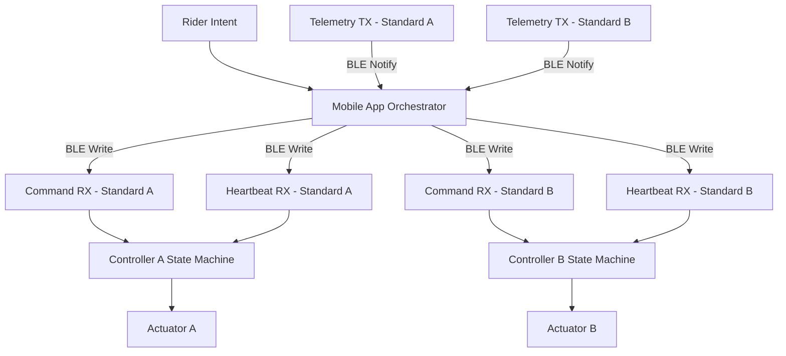

# Smart Jump Prototype

---

# Automated Jump Infrastructure for Mounted Training

A synchronization-aware, safety-first control system that converts manual jump height adjustment into deterministic, supervised motion.

This project models the control architecture behind a mounted Bluetooth-operated jump standard system designed for performance riders and professional training facilities.

---

## The Core Thesis

Jump training should be limited by skill — not by logistics.

In modern show jumping environments, height adjustments occur repeatedly within a single session:

Warmup → Progression → Technical combinations → Competition height → Reset

Each transition today requires:

Dismount → Lift poles → Adjust cups → Remount → Resume

That friction compounds.

It costs time.  
It breaks rhythm.  
It adds physical strain.  
It limits solo training.  

Smart Jump reframes height adjustment as infrastructure — not labor.

---

## Why Now

Training environments are modernizing.

- Riders train independently more often.
- Barns optimize lesson throughput.
- Technology adoption in sport is accelerating.
- Wearables, performance analytics, and smart equipment are increasing.

Yet jump adjustment remains entirely manual.

The opportunity is not novelty.  
The opportunity is operational efficiency inside an unchanged workflow.

---

## System Concept

The system consists of:

Two independent jump standards  
One supervisory mobile orchestrator  
Bluetooth Low Energy communication  
Dual-layer safety enforcement  

Each standard is a self-contained safety device.

The mounted application acts as synchronization authority.

Motion is supervised at every layer.

---

## Operational Impact

### Time & Rhythm

- Eliminates repeated mount/dismount cycles  
- Preserves training momentum  
- Increases productive arena minutes  

### Physical Strain Reduction

- Removes repetitive pole lifting  
- Reduces instructor fatigue  
- Supports injured trainers  

### Solo Training Enablement

- Safe mounted height adjustment  
- No ground crew required  
- Increased autonomy  

### Facility Differentiation

- Technology-forward positioning  
- Premium infrastructure signaling  
- Competitive branding advantage  

---

## Architecture Overview

The control model is layered and deterministic.

### End-to-End Data Flow

---

## Safety Architecture

Safety enforcement exists at two independent layers.

### Controller Layer (Local Authority)

The standard guarantees:

- Motion only in idle_ready  
- Stop accepted in all states  
- Heartbeat timeout → fault  
- Fault latched until explicit reset  
- Limit or overload triggers immediate halt  

### Orchestrator Layer (Supervisory Authority)

The app guarantees:

- Continuous telemetry monitoring  
- Configurable desynchronization tolerance  
- Coordinated stop across both standards  
- Device fault propagation  
- Explicit reset before reactivation  

If either standard deviates beyond tolerance, motion halts across the system.

All invariants are validated through deterministic simulation.

---

## Technical Capabilities

The current prototype implements:

- BLE contract modeling
- Dual-controller synchronization logic
- Heartbeat supervision
- Configurable desync tolerance
- Deterministic state machines
- Coordinated fault handling
- CI-validated safety tests

This repository models control logic prior to hardware deployment.

---

## Financial Feasibility

Target build range: $2000–$4000

Design philosophy: practical, barn-feasible engineering — not industrial overdesign.

Key cost-sensitive areas:

| Category | Design Tradeoff |
|----------|----------------|
| Actuators | Load capacity vs speed |
| Encoders | Precision vs cost |
| Controller | ESP32-class MCU |
| Power | Battery vs fixed supply |
| Mechanical | Backlash tolerance |
| Safety | Limit switches + hard stops |

Objective: achievable upgrade for serious private facilities.

---

## Competitive Positioning

| Traditional Setup | Smart Jump |
|-------------------|------------|
| Manual labor | Automated motion |
| Interruptions between sets | Continuous flow |
| Requires assistance | Solo-capable |
| Physically repetitive | Mechanically assisted |
| Static infrastructure | Intelligent infrastructure |

This is not gadgetry.  
It is training infrastructure modernization.

---

## Development Discipline

The repository follows structured engineering workflow:

Issue → Branch → Merge Request → CI → Merge → Close

Enforced through:

- Structured issue templates  
- Structured merge request template  
- No direct commits to main  
- Deterministic safety validation  

This mirrors safety-conscious systems development practices.

---

## Repository Structure

app/ — Orchestrator logic  
ble/ — Firmware BLE emulator  
tests/ — Safety validation  
docs/ — Architecture + state diagrams  
firmware/ — Planned embedded implementation  
hardware/ — Mechanical planning  
mobile_app/ — Future mounted UI  

---

## Roadmap

Phase 1 — Deterministic Control Modeling (Complete)  
Phase 2 — ESP32 Firmware Integration  
Phase 3 — Actuator + Encoder Hardware Validation  
Phase 4 — Mechanical Load Testing  
Phase 5 — Mounted Field Trials  
Phase 6 — Cost Optimization & Production Modeling  

---

## Demonstration

Run tests:

python3 -m pytest -q

Run simulation:

python3 demo_run.py

The demo validates:

- Synchronized motion  
- Desync fault detection  
- Coordinated stop enforcement  
- Deterministic state transitions  

---

Smart Jump represents a transition from manual physical adjustment to synchronized, safety-controlled equestrian infrastructure.

