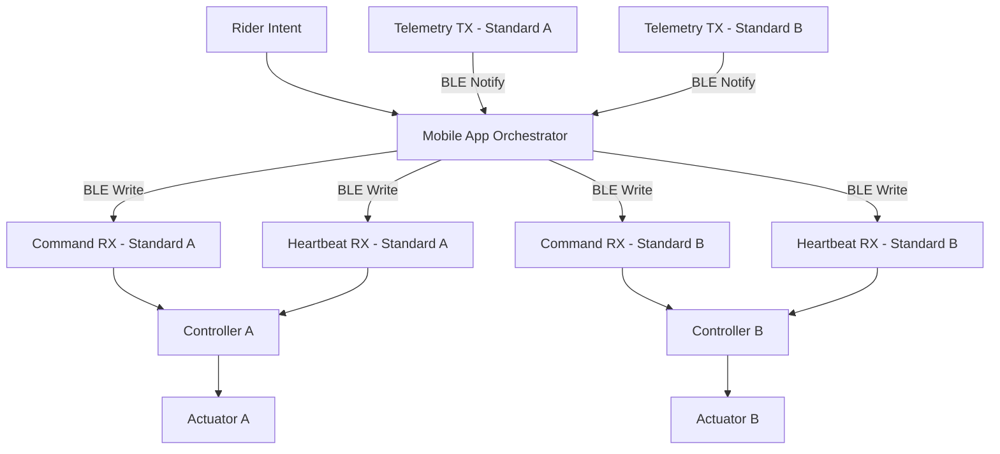

# Smart Jump Prototype

---

# Mounted Bluetooth-Controlled Jump Standards

A synchronization-aware, safety-first control system designed to eliminate manual height adjustment during mounted equestrian training.

---

## 1. The Operational Problem

### Current Workflow Reality

| Step | Manual Process | Impact |
|------|---------------|--------|
| 1 | Warm up at lower height | Acceptable |
| 2 | Dismount | Breaks rhythm |
| 3 | Lift heavy poles | Physical strain |
| 4 | Reposition cups | Time-consuming |
| 5 | Remount | Interrupts session |
| 6 | Resume training | Lost efficiency |

### Real-World Pain Points

- Riders training alone
- Junior riders without ground crew
- Injured trainers unable to lift poles
- High-volume barns losing session time
- Physical fatigue from repeated adjustments

Manual height changes are heavy, repetitive, inefficient, and operationally disruptive.

---

## 2. Proposed System

Smart Jump replaces manual repositioning with controlled synchronized movement.

Mounted rider selects preset height → both standards move simultaneously → safety system supervises motion → system locks into stable state.

---

## 3. Value Proposition

### Efficiency Gains

| Metric | Manual | Automated |
|--------|--------|-----------|
| Adjustment time | 1–3 minutes | < 10 seconds |
| Physical effort | High | None |
| Rhythm disruption | Yes | No |
| Solo adjustment | Unsafe | Controlled |

### Facility-Level Benefits

- Increased training throughput
- Reduced instructor strain
- Modernized infrastructure positioning
- Solo training capability
- Premium differentiation

---

## 4. System Architecture

### High-Level Data Flow

---

## 5. Safety Model

### Dual-Layer Protection

| Layer | Enforcement |
|-------|------------|
| Controller | Motion gating, heartbeat timeout, stop acceptance |
| Orchestrator | Desync detection, coordinated stop, fault propagation |

### Safety Guarantees

- No motion unless idle_ready
- Stop accepted in all states
- Faults latched until reset
- Heartbeat loss triggers fault
- Configurable desync tolerance
- Coordinated stop across standards

All safety invariants validated through deterministic simulation tests.

---

## 6. Technical Capabilities

| Capability | Status |
|------------|--------|
| BLE Contract Modeling | Complete |
| Dual Controller Synchronization | Complete |
| Heartbeat Supervision | Complete |
| Desync Fault Handling | Complete |
| Configurable Tolerance | Complete |
| CI Validation | Active |
| Firmware Deployment | Planned |
| Hardware Integration | Planned |

---

## 7. Financial Feasibility

Target build cost: $2000–$4000

| Component Category | Considerations |
|-------------------|---------------|
| Actuators | Load rating vs speed tradeoff |
| Encoders | Precision vs cost |
| Controller | ESP32-class MCU |
| Power System | Battery vs external supply |
| Mechanical | Backlash tolerance |
| Safety | Limit switches, hard stops |

Designed to remain within realistic private-barn upgrade budgets.

---

## 8. Development Workflow

Structured engineering discipline:

Issue → Branch → Merge Request → CI → Merge → Close

Enforced by:

- Structured issue templates
- Structured MR template
- No direct commits to main
- Deterministic safety tests

---

## 9. Repository Structure

| Directory | Purpose |
|------------|---------|
| app/ | Orchestrator logic |
| ble/ | Firmware BLE emulator |
| tests/ | Safety validation |
| docs/ | Architecture diagrams |
| firmware/ | Planned embedded layer |
| hardware/ | Mechanical planning |
| mobile_app/ | Mounted UI layer |
| test_artifacts/ | Validation logs |

---

## 10. Roadmap

| Phase | Milestone |
|-------|----------|
| Phase 1 | Deterministic control modeling (Complete) |
| Phase 2 | ESP32 firmware integration |
| Phase 3 | Actuator + encoder hardware testing |
| Phase 4 | Mechanical validation & load testing |
| Phase 5 | Mounted field testing |
| Phase 6 | Cost optimization & production modeling |

---

## 11. Demonstration

Run tests:

python3 -m pytest -q

Run demo:

python3 demo_run.py

Demo validates:

- Synchronized motion
- Desync fault detection
- Coordinated stop behavior
- Deterministic state transitions

---

Smart Jump represents a transition from manual physical adjustment to synchronized, safety-controlled infrastructure for equestrian performance environments.

