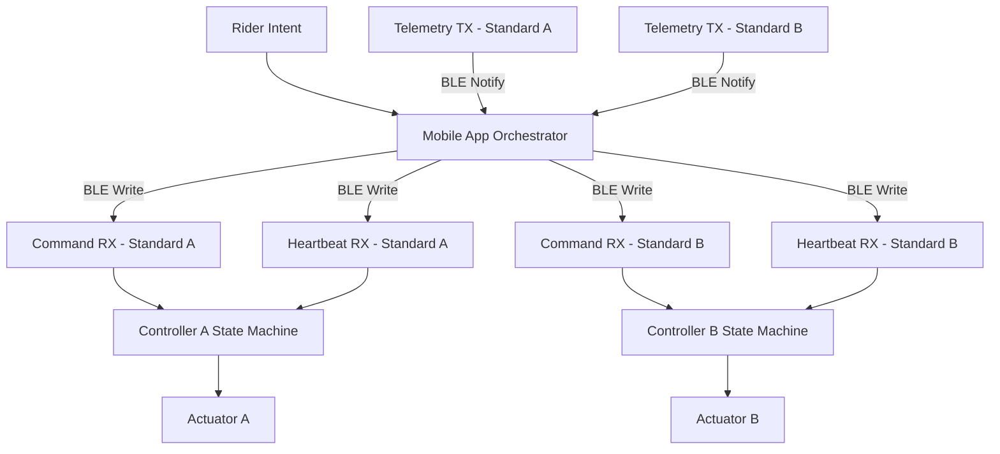

# Smart Jump Prototype

---

# Mounted Bluetooth-Controlled Jump Standards

A safety-first, synchronized control system designed to eliminate manual jump height adjustment during mounted training.

---

## The Reality of Training

In modern show jumping, riders constantly adjust height between:

Warmup → Progressive Sets → Competition Height → Technical Exercises

Today this requires:

Dismount → Lift poles → Reposition cups → Remount → Resume

This cycle repeats throughout a session.

It interrupts rhythm.  
It consumes time.  
It creates physical strain.  
It limits solo training.  

For high-performance riders and training barns, that friction compounds daily.

---

## The Shift

Smart Jump converts height adjustment from manual labor into a controlled system action.

The rider selects a preset height from a mounted interface.  
Both standards move simultaneously.  
The system supervises every millisecond of motion.  
If anything deviates, motion stops instantly.

The goal is not convenience alone.  
The goal is controlled infrastructure.

---

## Where It Delivers Value

### Operational Impact

• Eliminates repeated mount/dismount cycles  
• Preserves training rhythm  
• Reduces physical lifting strain  
• Enables independent practice  
• Increases productive arena time  

### Facility-Level Advantage

• Technology-forward differentiation  
• Reduced instructor fatigue  
• Higher throughput per lesson block  
• Improved safety posture  

---

## System Architecture

The system consists of two independent standards and one supervisory orchestrator.

Each standard is a self-contained safety device.

The mobile application acts as a synchronization authority.

### End-to-End Control Flow

---

## Safety Model

Safety is enforced at two independent layers.

### Controller Layer

The standard itself guarantees:

- Motion only in idle_ready
- Stop accepted in all states
- Heartbeat timeout triggers fault
- Fault latched until explicit reset
- Limit or overload causes immediate halt

### Orchestrator Layer

The mobile app guarantees:

- Continuous telemetry supervision
- Configurable desynchronization tolerance
- Coordinated stop across both standards
- Fault propagation from either side
- Explicit reset required before reactivation

If synchronization diverges beyond tolerance, both standards stop.

Deterministic simulation validates every safety invariant.

---

## Technical Capabilities

Current implementation provides:

- BLE contract emulation
- Dual-controller synchronization logic
- Heartbeat enforcement
- Desync detection with configurable tolerance
- Deterministic state machine behavior
- CI-validated safety tests

This repository models system behavior before hardware integration.

---

## Financial Feasibility

Target build range: $2000–$4000

The system is designed around realistic component tradeoffs:

| Component | Design Consideration |
|-----------|---------------------|
| Actuators | Load rating vs response speed |
| Encoders | Precision vs cost |
| Controller | ESP32-class MCU |
| Power | Battery vs external supply |
| Mechanical | Backlash tolerance |
| Safety | Limit switches and hard stops |

The objective is feasibility for private barns and performance facilities — not industrial overengineering.

---

## Development Discipline

Engineering workflow:

Issue → Branch → Merge Request → CI → Merge → Close

Enforced by:

- Structured issue templates
- Structured merge request template
- No direct commits to main
- Deterministic safety testing

This mirrors real-world safety-critical development practice.

---

## Repository Structure

app/  
Orchestrator logic  

ble/  
Firmware BLE emulator  

tests/  
Safety validation  

docs/  
Architecture and state diagrams  

firmware/  
Planned embedded implementation  

hardware/  
Mechanical and electrical planning  

mobile_app/  
Future mounted interface  

---

## Roadmap

Phase 1 — Deterministic Control Modeling (Complete)  
Phase 2 — ESP32 Firmware Integration  
Phase 3 — Actuator + Encoder Hardware Validation  
Phase 4 — Mechanical Load Testing  
Phase 5 — Mounted Field Trials  
Phase 6 — Cost Optimization & Production Planning  

---

## Running the Prototype

Tests:

python3 -m pytest -q

Demo:

python3 demo_run.py

The demo validates synchronized motion, desync faults, and coordinated stop behavior.

---

Smart Jump represents the transition from manual adjustment to synchronized, safety-controlled training infrastructure.

