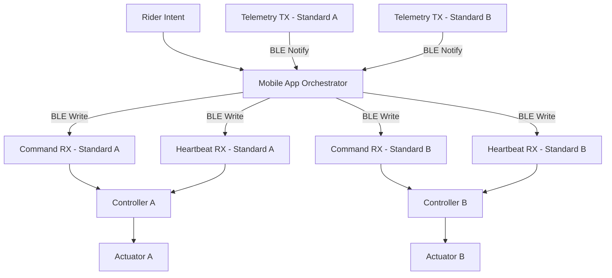

# 
#   ███████╗███╗   ███╗ █████╗ ██████╗ ████████╗      ██╗██╗   ██╗███╗   ███╗██████╗ 
#   ██╔════╝████╗ ████║██╔══██╗██╔══██╗╚══██╔══╝      ██║██║   ██║████╗ ████║██╔══██╗
#   ███████╗██╔████╔██║███████║██████╔╝   ██║         ██║██║   ██║██╔████╔██║██████╔╝
#   ╚════██║██║╚██╔╝██║██╔══██║██╔══██╗   ██║    ██   ██║██║   ██║██║╚██╔╝██║██╔═══╝ 
#   ███████║██║ ╚═╝ ██║██║  ██║██║  ██║   ██║    ╚█████╔╝╚██████╔╝██║ ╚═╝ ██║██║     
#   ╚══════╝╚═╝     ╚═╝╚═╝  ╚═╝╚═╝  ╚═╝   ╚═╝     ╚════╝  ╚═════╝ ╚═╝     ╚═╝╚═╝     

---

### Intelligent Jump Infrastructure for Mounted Training

A synchronization-aware, safety-first control system that transforms manual height adjustment into supervised, deterministic motion.

---

## The Vision

Jump training should be limited by skill — not by logistics.

Today, height changes require dismounting, lifting heavy poles, repositioning cups, and remounting.  
This process interrupts rhythm, consumes time, and adds physical strain.

Smart Jump converts that manual friction into synchronized infrastructure.

Mounted preset → coordinated motion → supervised stop → locked safe state.

---

## Why It Matters

> Every interruption during training compounds across riders, sessions, and facilities.  
> Smart infrastructure preserves momentum.

---

## Operational Impact

### Efficiency

• Eliminates repeated mount/dismount cycles  
• Preserves rhythm between sets  
• Increases usable arena time  

### Physical Strain Reduction

• Removes repetitive pole lifting  
• Reduces instructor fatigue  
• Enables injured trainers to continue working  

### Solo Capability

• Mounted adjustment without assistance  
• Safe synchronized movement  
• No ground crew required  

---

## System Architecture

The control model is layered.

Each standard is an independent safety device.  
The mobile app acts as supervisory authority.

### End-to-End Flow

---

## Safety Model

Dual-layer protection ensures deterministic behavior.

### Controller Guarantees

- Motion only in idle_ready  
- Stop accepted in all states  
- Heartbeat timeout triggers fault  
- Fault latched until reset  
- Limit or overload causes immediate halt  

### Orchestrator Guarantees

- Continuous telemetry supervision  
- Configurable desync tolerance  
- Coordinated stop across standards  
- Fault propagation  
- Explicit reset required before reactivation  

All invariants validated via deterministic simulation.

---

## Demo

Below is a representative simulation run showing synchronized motion and desync fault handling.

<!-- Replace with actual GIF once recorded -->

To run locally:

python3 -m pytest -q  
python3 demo_run.py  

---

## Technical Scope

Current prototype includes:

- BLE contract emulation  
- Dual-controller synchronization logic  
- Configurable desync tolerance  
- Coordinated stop behavior  
- Deterministic state machine validation  
- CI safety enforcement  

This repository models control architecture prior to hardware integration.

---

## Financial Target

Designed for feasibility within a $2000–$4000 hardware build range.

Practical component strategy:

| Category | Tradeoff Focus |
|----------|---------------|
| Actuators | Load vs speed |
| Encoders | Precision vs cost |
| MCU | ESP32-class |
| Power | Battery vs supply |
| Mechanical | Backlash tolerance |
| Safety | Hard stops + limits |

Objective: realistic deployment for private performance barns.

---

## Competitive Framing

| Traditional Setup | Smart Jump |
|-------------------|------------|
| Manual adjustment | Automated synchronization |
| Interrupted training | Continuous flow |
| Physical strain | Mechanically assisted |
| Static equipment | Intelligent infrastructure |

---

## Development Discipline

Structured engineering workflow:

Issue → Branch → Merge Request → CI → Merge → Close

Enforced through templates and deterministic test validation.

---

## Roadmap

Phase 1 — Deterministic Control Modeling (Complete)  
Phase 2 — ESP32 Firmware Integration  
Phase 3 — Actuator + Encoder Validation  
Phase 4 — Mechanical Load Testing  
Phase 5 — Mounted Field Trials  
Phase 6 — Production Cost Optimization  

---

Smart Jump represents the modernization of equestrian training infrastructure through synchronized, safety-controlled automation.

