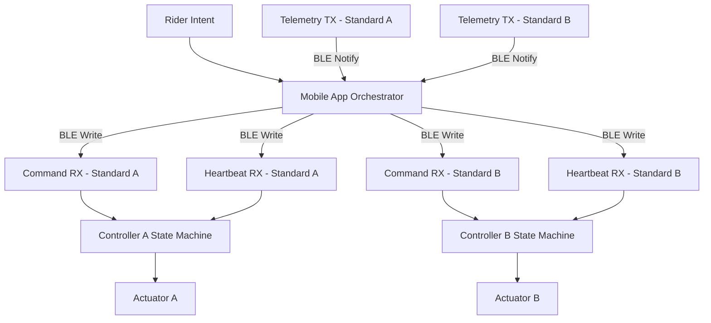

# Smart Jump Prototype

Mounted Bluetooth Control System for Automated Jump Standards  

A synchronization-aware, safety-first system architecture designed to eliminate manual jump height adjustment during mounted training.

---

## Executive Overview

Show jumping training requires frequent height adjustments:

Warmup height → working height → adjusted combinations → repetition.

Today, this process requires:

- Dismounting
- Physically lifting poles
- Manually repositioning cups
- Remounting
- Interrupting rhythm and training flow

This creates operational inefficiencies, physical strain, and safety concerns — particularly for:

- Riders training alone
- Junior riders without ground support
- Trainers managing multiple students
- Trainers with physical limitations
- High-volume performance barns

Smart Jump transforms height adjustment from manual labor into a controlled, synchronized system operation.

---

## Market Context

### Target Users

- Private riders training independently  
- Performance barns with high lesson turnover  
- Competitive riders optimizing arena time  
- Trainers managing multiple athletes  
- Facilities investing in modernization  

### Operational Value

**Time Efficiency**  
Eliminates repeated mount/dismount cycles and increases productive arena time.

**Reduced Physical Strain**  
Removes repetitive lifting of heavy poles and standards.

**Solo Training Enablement**  
Allows mounted height changes without ground assistance.

**Facility Differentiation**  
Positions barns as technology-forward and efficiency-focused.

**Injury Accessibility**  
Supports continued training when lifting is limited or restricted.

---

## System Concept

The system consists of two independent jump standards, each running a local safety controller.

A mounted mobile application connects to both standards via Bluetooth Low Energy and orchestrates synchronized motion.

Each standard enforces:

- Deterministic motion state machine
- Height tracking
- Heartbeat timeout enforcement
- Fault latching
- Stop gating
- Limit protection

The app enforces:

- Coordinated preset commands
- Continuous heartbeat supervision
- Telemetry validation
- Desynchronization detection
- Coordinated stop on anomaly
- Explicit reset after fault

The current repository implements deterministic firmware emulation and orchestrator logic to validate safety behavior prior to hardware deployment.

---

## System Architecture

### End-to-End Data Flow

---

## Safety Architecture

Safety enforcement exists at two independent layers.

### Controller Layer

- Motion allowed only in idle_ready  
- Heartbeat timeout triggers fault  
- Stop accepted in all states  
- Faults latched until reset  
- Limit or overload causes immediate halt  

### Orchestrator Layer

- Continuous telemetry monitoring  
- Configurable desynchronization tolerance  
- Coordinated stop across both standards  
- Device fault propagation  
- Explicit reset required before reactivation  

All behaviors are validated through deterministic simulation tests.

---

## Repository Structure

app/  
Application-level orchestration and safety supervision  

ble/  
Bluetooth GATT emulator modeling firmware contract  

tests/  
Deterministic unit tests validating safety invariants  

docs/  
Architecture diagrams and system documentation  

firmware/  
Planned embedded firmware implementation  

hardware/  
Mechanical and electrical planning  

mobile_app/  
Future mounted UI layer  

test_artifacts/  
Reserved validation outputs  

---

## Validation

Run automated tests:

python3 -m pytest -q

Run simulation demo:

python3 demo_run.py

The demo validates:

- Synchronized motion behavior  
- Desync fault detection  
- Coordinated stop enforcement  
- Deterministic state transitions  

---

## Development Discipline

This project follows structured engineering workflow:

Issue → Feature Branch → Merge Request → CI → Merge → Issue Close  

Enforced by:

- Structured issue templates  
- Structured merge request template  
- No direct commits to main  
- CI validation before merge  

---

## Financial Target

Designed for feasibility within a $2000–$4000 hardware build range.

Future cost modeling will include:

- Actuator selection  
- Encoder precision tradeoffs  
- Mechanical load modeling  
- Battery and power design  
- Environmental durability constraints  

---

## Roadmap

Phase 1 — Deterministic Control Modeling (Complete)  
Phase 2 — Firmware Integration (ESP32-based controllers)  
Phase 3 — Actuator + Encoder Hardware Integration  
Phase 4 — Mechanical Validation & Load Testing  
Phase 5 — Mounted Field Testing  
Phase 6 — Cost Optimization & Production Modeling  

---

## Current Status

Completed:

- BLE contract modeling  
- Dual-controller synchronization logic  
- Heartbeat enforcement  
- Desync detection with configurable tolerance  
- Deterministic state machine design  
- CI integration  
- Structured workflow enforcement  

This repository represents a safety-first control prototype positioned for hardware transition.

