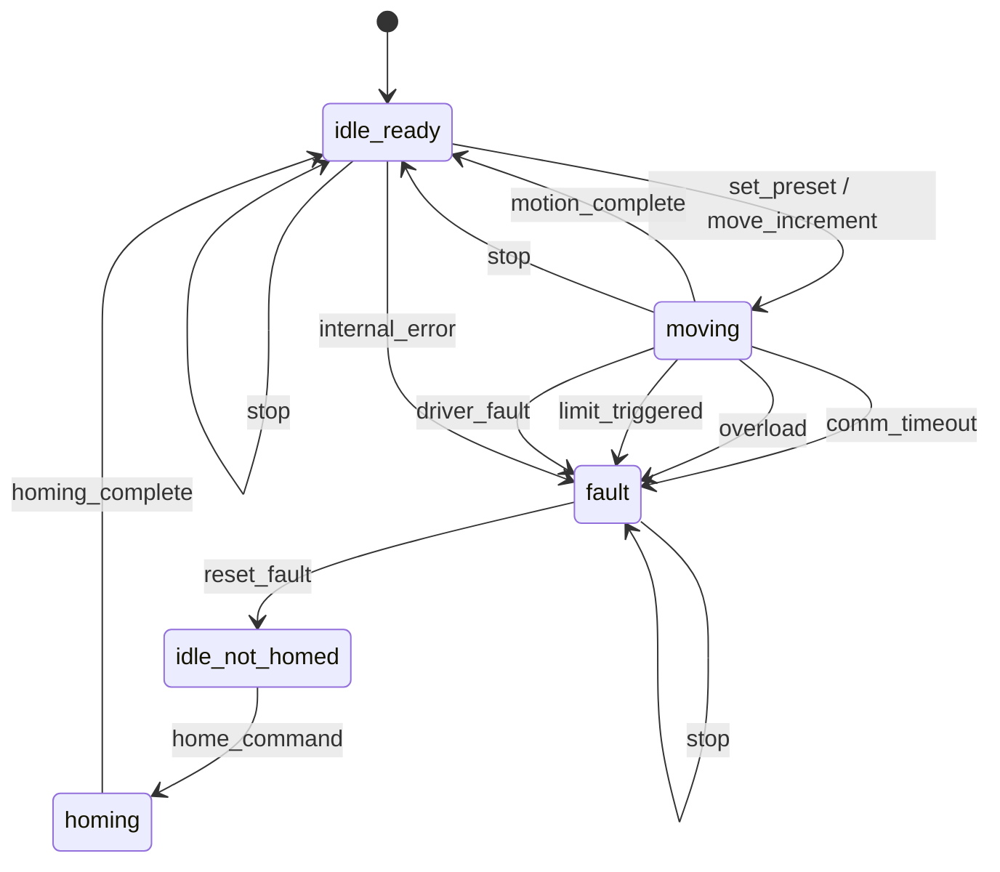
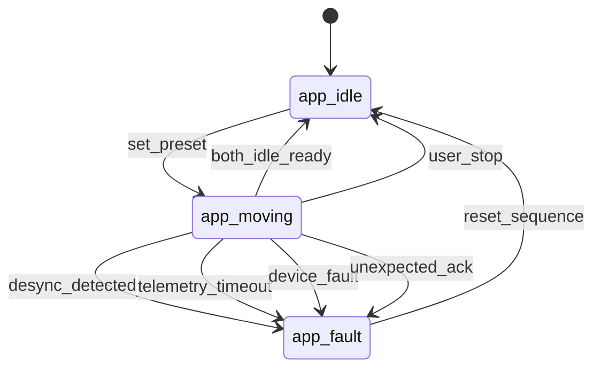

# Smart Jump State Machine Diagrams

This document defines the formal state machines for:

1. Standard Controller (device firmware)  
2. Mobile App Orchestrator (control authority)  

---

## 1. Standard Controller State Machine

Device guarantees:
- stop always accepted  
- watchdog triggers fault while moving  
- fault is latched until reset  
- no motion allowed unless in idle_ready  

---

## 2. App Orchestrator State Machine

App guarantees:
- monitors both standards continuously  
- enforces desync tolerance  
- enforces telemetry timeout  
- issues stop to both on any anomaly  
- requires explicit reset after fault  