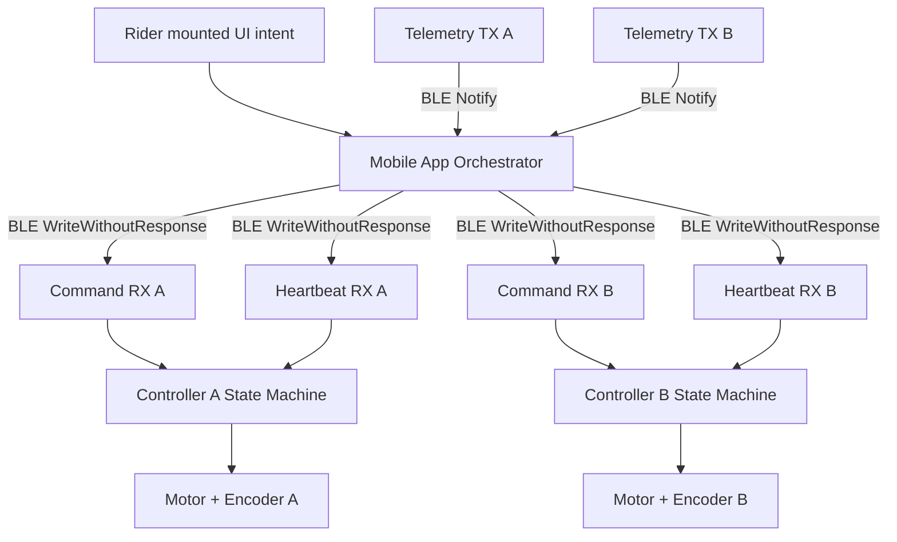

# System Architecture

This project models a mounted Bluetooth control system for an automated jump.

The implementation is structured as layered contracts so real hardware can replace simulated components without rewriting the control logic.

---

## End to end data flow

---

## Core responsibilities

### Controller device responsibilities
- execute motion safely using a local deterministic state machine  
- stop immediately on internal fault  
- stop if heartbeats stop while moving  
- stream telemetry at bounded rate  
- never move unless in idle_ready  

### App orchestrator responsibilities
- send synchronized commands to both standards  
- continuously transmit heartbeat to both  
- detect desync beyond tolerance  
- stop both immediately on any anomaly  
- enter app_fault state and require explicit reset  

---

## Safety boundary

The controller firmware is the real time safety boundary.

If Bluetooth fails, the controller must stop motion independently.

The mobile app provides coordination, not safety enforcement.

---

## Layered separation

Layer 1: Physical hardware  
- motors  
- encoders  
- limit switches  

Layer 2: Firmware state machine  
- motion control  
- heartbeat watchdog  
- fault latching  

Layer 3: BLE transport contract  
- command characteristic  
- telemetry characteristic  
- heartbeat channel  

Layer 4: Mounted app orchestrator  
- synchronization logic  
- desync detection  
- coordinated stop propagation  

---

## Design goal

A rider can adjust jump height while mounted without requiring:
- dismounting  
- a ground assistant  
- manual pin adjustment  

All while maintaining deterministic fail safe behavior.